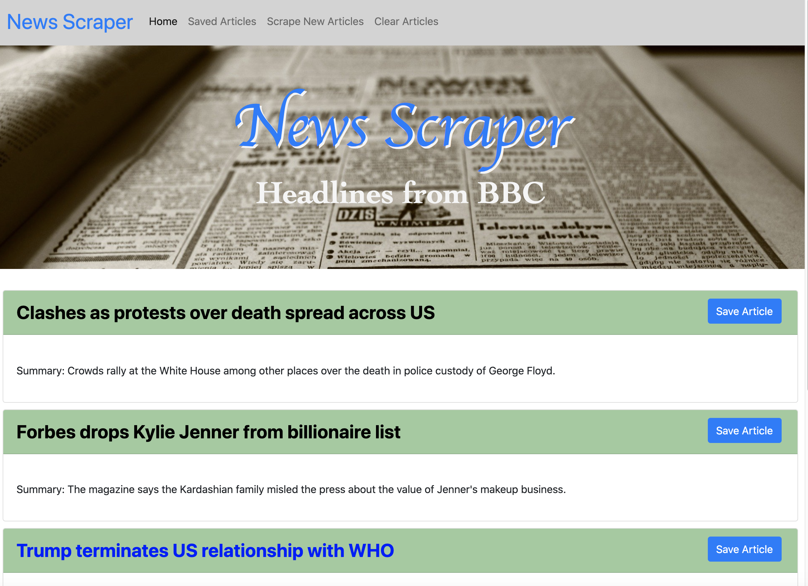

# News-Scrape
Coding Bootcamp
Unit 18: MongoDB HW

## Heroku DB live demo: 
https://quiet-mesa-28280.herokuapp.com/

#### Overview:
An application designed to scrape top headlines from the BBC world page. It allows users to add new articles to the existing ones listed as well as clear all articles.  If a user saves an article from the home page, it will populate the "saved articles" page where the user can also view others comments as well as add their own comments for each article.

#### Technology Used:
* Front-end: 
    - primarily Bootstrap for styling
    - Express Handelbars for rendering
* Back-end: 
    - Nodejs/express
    - Express Handlebars
    - MongoDB for database, Mongoose node package
    - Axios and Cheerio for scraping

App screenshot
